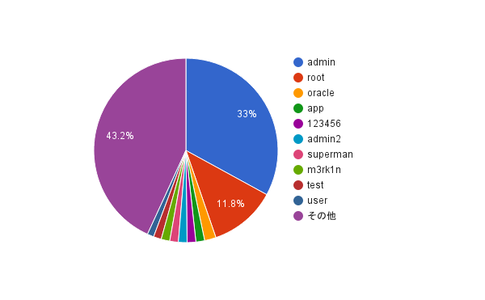

# Cowrie Log 2015

### Session Count


### Top 10 usernames



### Top 10 passwords


### Top 10 base words
```
admin = 23714 (20.32%)
root = 2130 (1.83%)
password = 1900 (1.63%)
test = 1344 (1.15%)
oracle = 656 (0.56%)
ubnt = 654 (0.56%)
user = 556 (0.48%)
www17161ui = 468 (0.4%)
qwerty = 442 (0.38%)
sakura = 408 (0.35%)
```

### Password length (length ordered)
```
1 = 1026 (0.88%)
2 = 1400 (1.2%)
3 = 4990 (4.28%)
4 = 9956 (8.53%)
5 = 30948 (26.52%)
6 = 20612 (17.66%)
7 = 9548 (8.18%)
8 = 14432 (12.37%)
9 = 7924 (6.79%)
10 = 5364 (4.6%)
11 = 2936 (2.52%)
12 = 2852 (2.44%)
13 = 1012 (0.87%)
14 = 1022 (0.88%)
15 = 574 (0.49%)
16 = 596 (0.51%)
17 = 274 (0.23%)
18 = 210 (0.18%)
19 = 132 (0.11%)
20 = 210 (0.18%)
21 = 36 (0.03%)
22 = 36 (0.03%)
23 = 80 (0.07%)
24 = 92 (0.08%)
25 = 20 (0.02%)
26 = 38 (0.03%)
27 = 16 (0.01%)
28 = 34 (0.03%)
29 = 54 (0.05%)
30 = 6 (0.01%)
31 = 18 (0.02%)
32 = 86 (0.07%)
33 = 16 (0.01%)
34 = 6 (0.01%)
36 = 6 (0.01%)
37 = 8 (0.01%)
38 = 6 (0.01%)
41 = 2 (0.0%)
43 = 2 (0.0%)
44 = 6 (0.01%)
45 = 4 (0.0%)
47 = 38 (0.03%)
48 = 4 (0.0%)
49 = 2 (0.0%)
50 = 2 (0.0%)
51 = 10 (0.01%)
55 = 2 (0.0%)
56 = 8 (0.01%)
57 = 14 (0.01%)
58 = 6 (0.01%)
61 = 4 (0.0%)
62 = 2 (0.0%)
63 = 2 (0.0%)
81 = 2 (0.0%)
100 = 2 (0.0%)
```


```
One to six characters = 68932 (59.07%)
One to eight characters = 92912 (79.62'%)
More than eight characters = 23776 (20.38%)

Only lowercase alpha = 66722 (57.18%)
Only uppercase alpha = 266 (0.23%)
Only alpha = 66988 (57.41%)
Only numeric = 13388 (11.47%)

First capital last symbol = 306 (0.26%)
First capital last number = 1960 (1.68%)

Single digit on the end = 4046 (3.47%)
Two digits on the end = 1298 (1.11%)
Three digits on the end = 9886 (8.47%)
```

### Last number
```
0 = 1612 (1.38%)
1 = 4124 (3.53%)
2 = 1770 (1.52%)
3 = 10978 (9.41%)
4 = 2728 (2.34%)
5 = 1886 (1.62%)
6 = 6152 (5.27%)
7 = 922 (0.79%)
8 = 1432 (1.23%)
9 = 1474 (1.26%)
```
```
   |                                                                    
   |                                                                    
   |                                                                    
   |                                                                    
   |                                                                    
   |                                                                    
   |                                                                    
   |  |                                                                 
   |  |                                                                 
 | |  |                                                                 
 | |  |                                                                 
 | |  |                                                                 
 | || |                                                                 
||||||| ||                                                              
||||||||||                                                              
||||||||||                                                              
0123456789
```

### Last digit
```
3 = 10978 (9.41%)
6 = 6152 (5.27%)
1 = 4124 (3.53%)
4 = 2728 (2.34%)
5 = 1886 (1.62%)
2 = 1770 (1.52%)
0 = 1612 (1.38%)
9 = 1474 (1.26%)
8 = 1432 (1.23%)
7 = 922 (0.79%)
```

### Last 2 digits (Top 10)
```
23 = 9564 (8.2%)
56 = 5532 (4.74%)
34 = 1798 (1.54%)
45 = 1110 (0.95%)
21 = 884 (0.76%)
11 = 690 (0.59%)
89 = 676 (0.58%)
12 = 534 (0.46%)
78 = 502 (0.43%)
00 = 494 (0.42%)
```

### Last 3 digits (Top 10)
```
123 = 9478 (8.12%)
456 = 5484 (4.7%)
234 = 1752 (1.5%)
345 = 1036 (0.89%)
321 = 678 (0.58%)
789 = 596 (0.51%)
678 = 460 (0.39%)
111 = 430 (0.37%)
000 = 348 (0.3%)
890 = 302 (0.26%)
```

### Last 4 digits (Top 10)
```
3456 = 5330 (4.57%)
1234 = 1740 (1.49%)
2345 = 1026 (0.88%)
5678 = 458 (0.39%)
6789 = 448 (0.38%)
1111 = 328 (0.28%)
4321 = 308 (0.26%)
7890 = 292 (0.25%)
4567 = 236 (0.2%)
0000 = 200 (0.17%)
```
### Last 5 digits (Top 10)
```
23456 = 5330 (4.57%)
12345 = 1020 (0.87%)
45678 = 448 (0.38%)
56789 = 446 (0.38%)
11111 = 292 (0.25%)
67890 = 292 (0.25%)
54321 = 254 (0.22%)
34567 = 234 (0.2%)
23123 = 180 (0.15%)
00000 = 162 (0.14%)
```
### Character sets
```
loweralpha: 66722 (57.18%)
loweralphanum: 20626 (17.68%)
numeric: 13388 (11.47%)
loweralphaspecialnum: 4324 (3.71%)
loweralphaspecial: 1784 (1.53%)
mixedalphanum: 1746 (1.5%)
mixedalphaspecialnum: 1686 (1.44%)
mixedalpha: 1066 (0.91%)
special: 848 (0.73%)
specialnum: 682 (0.58%)
mixedalphaspecial: 330 (0.28%)
upperalphanum: 290 (0.25%)
upperalpha: 266 (0.23%)
upperalphaspecial: 182 (0.16%)
upperalphaspecialnum: 126 (0.11%)
```

### Character set ordering
```
allstring: 68054 (58.32%)
stringdigit: 13632 (11.68%)
alldigit: 13388 (11.47%)
othermask: 11472 (9.83%)
digitstring: 2558 (2.19%)
stringspecialdigit: 2360 (2.02%)
stringdigitstring: 2038 (1.75%)
allspecial: 848 (0.73%)
stringspecial: 778 (0.67%)
stringspecialstring: 714 (0.61%)
digitstringdigit: 430 (0.37%)
specialstring: 210 (0.18%)
specialstringspecial: 206 (0.18%)
```
